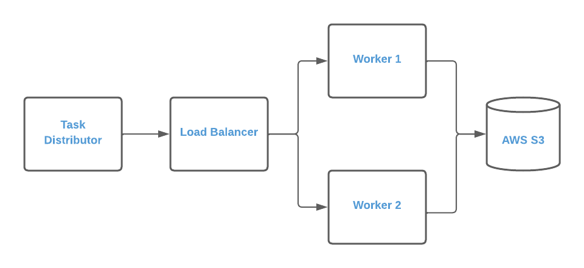
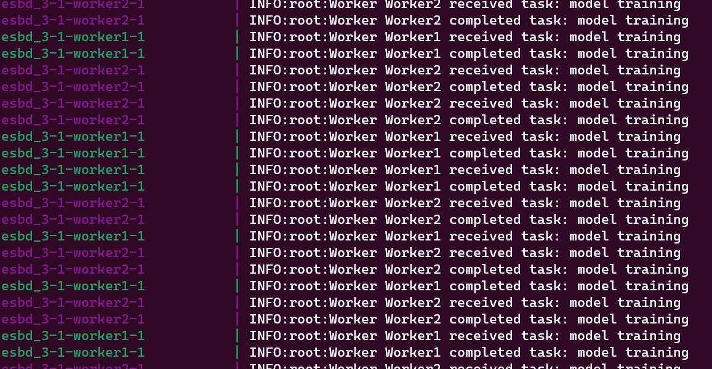
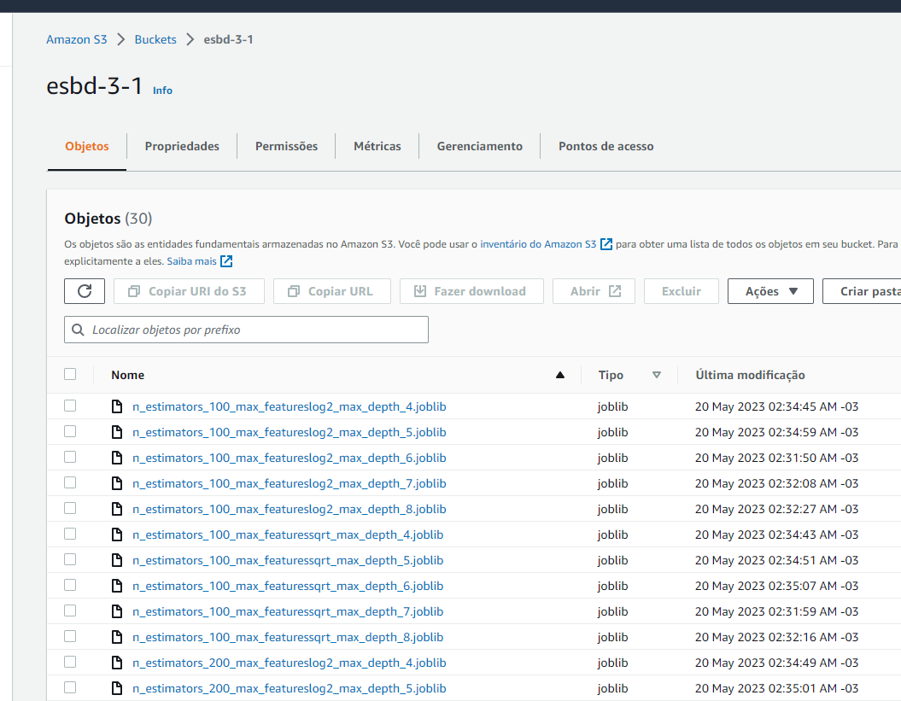

# Arquitetura "Producer-Consumer" ou "Publish-Subscribe" para treinamento de modelos de ML

A arquitetura implementada é um exemplo de um padrão de projeto de software chamado "Producer-Consumer" ou "Publish-Subscribe", especialmente quando implementado usando ZeroMQ. Este padrão é comumente utilizado em sistemas de processamento de mensagens e em aplicações onde a tarefa de processamento é intensiva e pode ser paralelizada.

**Producer-Consumer (Produtor-Consumidor)**

Neste caso, o Task Distributor age como um produtor, que gera tarefas ou mensagens a serem processadas. Os Workers atuam como consumidores, que pegam as tarefas do produtor e realizam o processamento necessário. O Load Balancer age como um tipo de "broker" ou intermediário, ajudando a distribuir as tarefas de maneira eficiente entre os vários consumidores.

**Publish-Subscribe (Publicar-Inscrever)**

O modelo Publish-Subscribe também pode ser aplicado a essa arquitetura, onde o Task Distributor é o publicador de tarefas e os Workers são os inscritos que recebem e processam as tarefas. Neste caso, o Load Balancer pode atuar como um mecanismo de roteamento de mensagens, garantindo que as tarefas sejam distribuídas de maneira adequada aos inscritos.

Vale destacar que esses padrões são bastante flexíveis e podem ser adaptados às necessidades específicas de uma aplicação. Por exemplo, o balanceamento de carga pode ser implementado de várias maneiras, dependendo de como as tarefas devem ser distribuídas entre os workers. Além disso, mecanismos adicionais podem ser implementados para lidar com falhas, retransmissão de tarefas e outros cenários.

Os principais componentes da arquitetura são:

1. **Task Distributor**: É o componente que distribui tarefas para os workers. Ele é responsável por definir quais tarefas precisam ser feitas e enviar essas tarefas para o balanceador de carga.

2. **Load Balancer (Balanceador de Carga)**: O balanceador de carga age como um intermediário entre o task distributor e os workers. Ele recebe tarefas do task distributor e as distribui entre os workers disponíveis.

3. **Workers (Trabalhadores)**: Os workers são responsáveis por executar as tarefas recebidas do balanceador de carga. Eles fazem o trabalho real (neste caso, treinando o modelo de machine learning).

Vantagens dessa arquitetura:

1. **Escalabilidade**: Esta arquitetura pode ser facilmente escalada adicionando mais workers. Isso permite que o sistema lide com uma maior quantidade de trabalho.

2. **Resiliência**: Se um worker falhar, as tarefas podem ser redistribuídas para outros workers, permitindo que o sistema continue funcionando.

3. **Eficiência**: Ao distribuir o trabalho entre múltiplas máquinas, o tempo total para completar todas as tarefas pode ser significativamente reduzido.

Limitações ou desvantagens dessa arquitetura:

1. **Complexidade**: Esta arquitetura é mais complexa do que uma arquitetura monolítica, pois requer a comunicação entre várias máquinas. Isso pode tornar o sistema mais difícil de desenvolver e manter.

2. **Overhead de Comunicação**: A comunicação entre o task distributor, o balanceador de carga e os workers pode introduzir atrasos. Isso é especialmente verdadeiro se a quantidade de dados que precisa ser transferida é grande.

3. **Balanceamento de Carga**: Dependendo de como o balanceamento de carga é implementado, pode ser que algumas máquinas acabem recebendo mais trabalho do que outras. Isso pode levar a um uso ineficiente dos recursos.

4. **Falhas na Rede**: Como a arquitetura depende da comunicação através da rede, quaisquer problemas na rede podem impactar o desempenho do sistema.

5. **Gerenciamento de Estado**: A arquitetura distribuída pode apresentar desafios quando se trata de gerenciamento de estado, particularmente se uma tarefa falhar e precisar ser retomada, ou se os resultados de várias tarefas precisam ser agregados de alguma forma.

Evidências do funcionamento da solução:

Evidência de uso dos dois workers criados para treinar os modelos de ML.

E escrita dos binários dos modelos em um bucket do Amazon S3.

