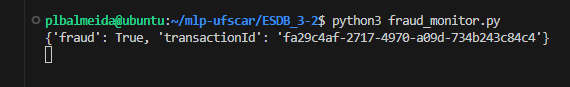

# ESBD 3.2 - Prática de sistemas distribuídos 2

A arquitetura do sistema para resolver o problema proposto foi dividida em quatro partes principais:

1. **Data Generator**: Este script Python gera transações de cartão de crédito aleatórias e as publica no tópico `creditcard_transactions` do Kafka.

2. **Dispatcher**: Este componente consome as mensagens publicadas pelo `data_generator.py` do tópico `creditcard_transactions` do Kafka. Em seguida, distribui essas mensagens para processamento no Worker através do ZeroMQ.

3. **Worker**: O Worker pega uma mensagem do Dispatcher, carrega o modelo SVM a partir do arquivo `svm.joblib`, faz a previsão para a transação e, se a transação for detectada como uma fraude, envia uma nova mensagem ao Fraud Monitor.

4. **Fraud Monitor**: Este componente recebe as mensagens dos Workers sobre transações fraudulentas e as publica no tópico `fraud_transactions` do Kafka.

No caso de uma falha do Worker, a mensagem que estava sendo processada pode ser perdida. Para evitar isso, poderíamos usar o padrão ROUTER-DEALER do ZeroMQ, que fornece comunicação bidirecional e controle de reconhecimento de recebimento de mensagens. Dessa forma, a mensagem só será removida da fila do Dispatcher após o reconhecimento do Worker.

### Evidência de funcionamento da solução:

